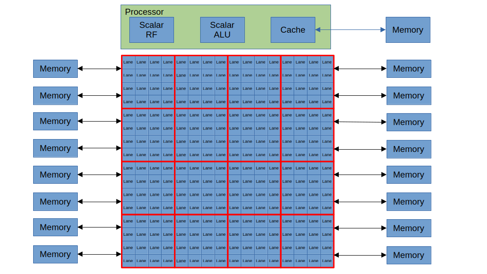
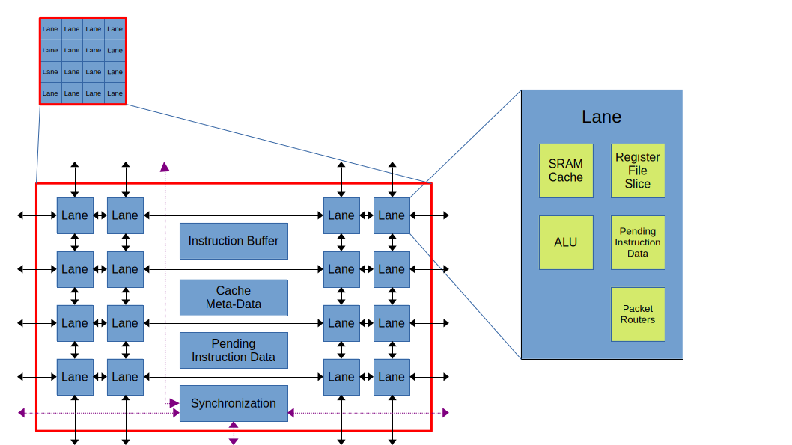

# Zamlet - A RISC-V vector processing unit

This is an exploratory project where I'm trying to create a vector processing unit for
a RISC-V core that scales to very large numbers of lanes.

It's still very much a work in progress, and most of work has been creating a model of the microarchitecture in python to
get of feel for whether the approach is practical and what the performance would be.
I've also done some work on implementation in Chisel to get a rough estimate
of what the area would look like.

This kind of microarchitecure is useful for  applications that operate on large vectors, where the control flow is
relatively independent of the vector data.  Applications such as Fully Homomorphic Encryption and
Machine Learning often fit into this category. 

I've made a start on some docs at [benreynwar.github.io/zamlet/](https://benreynwar.github.io/zamlet/).


## Approach



**Lanes are arranged in a grid.** If we want the design to scale to large numbers of lanes, we don't really have any other choices.

**The lanes are connected with a mesh network.** The standard approach for connecting the lanes would be with a crossbar. This works really well for small numbers of lanes, but becomes impractical as the number of lanes becomes large, both because of the crossbar itself and because of the buffers necessary to keep everything synchronous. A mesh network is an alternative that will work nicely as long as most of the data movement is fairly local.

**An additional layer of hierarchy is introduced between the lane and the processor.** As our number of lanes grows large it becomes useful to add another layer of hierarchy into the design. A grouping of lanes share an instruction buffer and other logic that is useful to keep fairly close to the lanes, but is too expensive to replicate in each lane.

**Keep data local where possible, message passing between lanes when that is not possible.** Common operations should result in minimal data movement. We want to minimize the movement of data in and out of the lanes. We distribute both the cache SRAM and the vector register file throughout the lanes, and ideally instructions should just be moving data between this cache SRAM, the vector register file slice and the lane's ALU. For instructions that do need to move data between lanes, this is done by message passing. This should be reasonably efficient when the data is moving between lanes close to one another. It will be inefficient when we are moving data large distances (both latency and throughput).

**Vector memory and vector registers have a physical byte ordering that is controlled by an element-width setting.** Each vector memory line and each vector register has an 'element-width'. This determines the order in which bytes are stored in the physical memory. If this 'element-width' matches the actual element width of the data then this will help keep the data local when vectors with different element-widths interact. The 'element-width' of the lines in each page is stored in a supplemental page table.  The hardware determines which element width to use based on the instruction, and converts between element widths when necessary.

**Custom hardware to synchronize the lane groupings.** Because of the message passing approach, the lane groupings can often be out of sync with one another. Rather than building synchronization out of the network-based message passing we add specialized hardware for synchronizing between the lane groupings when this is required.



## Setup

Dependencies are installed using nix.
The build itself is done using bazel.

1. Install nix
2. Add the following to /etc/nix/nix.conf
    ```
    extra-experimental-features = nix-command flakes
    extra-substituters = https://nix-cache.fossi-foundation.org
    extra-trusted-public-keys = nix-cache.fossi-foundation.org:3+K59iFwXqKsL7BNu6Guy0v+uTlwsxYQxjspXzqLYQs=
    ```
    This allows nix to use the precompiled FOSSi binaries which speeds things up a bunch.
3. Run `nix-shell` in the project directory.
4. Use bazel to build a target
