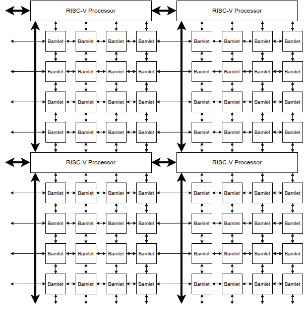
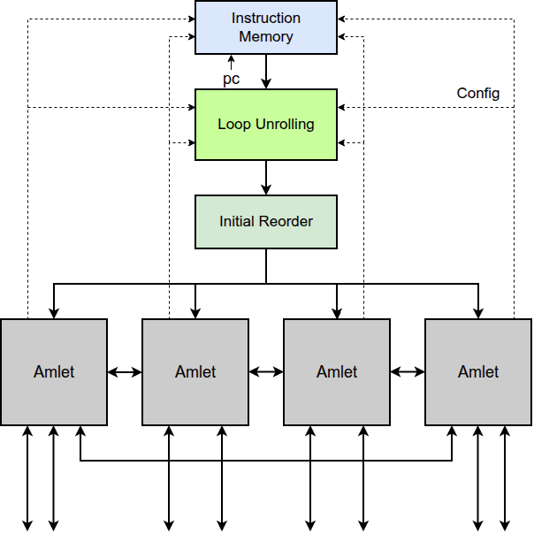
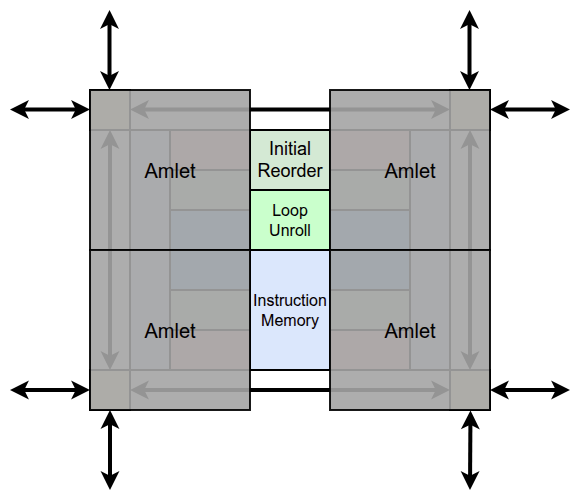
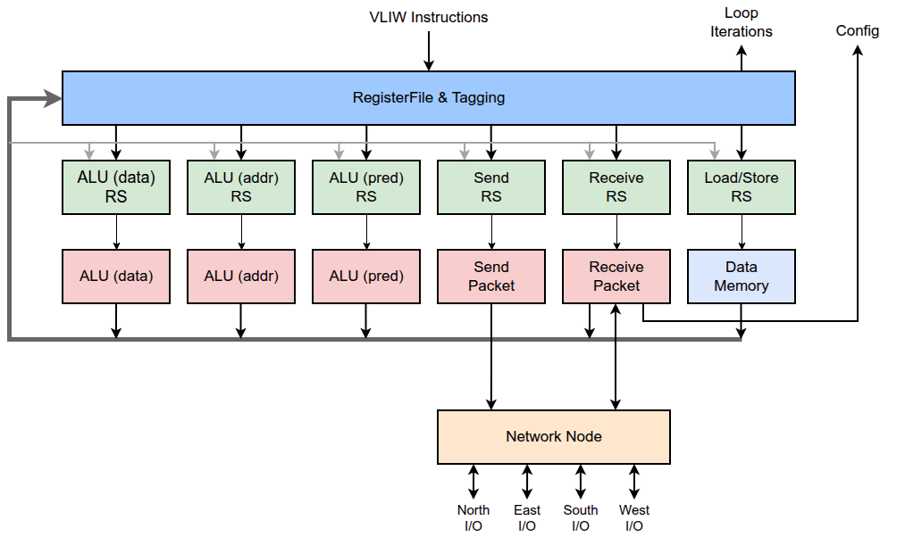
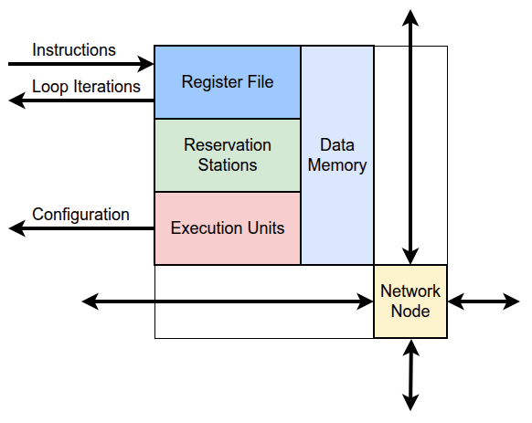

# Architecture Overview

Zamlet implements a hierarchical VLIW SIMD processor designed for parallel computation 
across processing elements in a mesh topology.

## Design Philosophy

The goal is to create an accelerator fabric that can be rapidly reconfigured.

I've focused on getting the main ALU utilization up by incorporating VLIW and
out-of-order techniques.  For the default configuration the main ALU just does 32-bit
arithmetic and is only about 5% of the area of the design.  All the overhead to increase
it's utilization doesn't make much sense.  We expect that in a real accelerator this main ALU would be customized for the workload
and would be considerably more complex. For example for cryptography applications it might be
replaced with a 64-bit modular-arithmetic ALU, in signal processing applications it might
support working on several 8-bit FP operands in parallel, or for a machine-learning
application it could be customized to support matrix-multiplications of multiple UInt8 in
parallel.

It's also just a fun problem trying to create a highly parallel processor without
sacrificing fast execution, and I'm making the problem tractable by only considering small
and simple kernels.

## Hierarchy

### Damlet (Future)
Multi-core RISC-V system integrated with Bamlet mesh for heterogeneous acceleration.

### Camlet (Future)
A RISC-V processor integrated with a Bamlet mesh.
Initially I plan to try to get the Bamlet mesh to execute vector instructions.

### Bamlet (VLIW SIMD Processor)

The Bamlet is the main processor containing:

- **Instruction Memory**: Stores VLIW instruction bundles, shared across Amlets
- **Control Unit**: Manages program flow, loop control, and SIMD dispatch  
- **Dependency Tracker**: Does some shuffling of slot contents between VLIW instructions
  so that a single VLIW instruction contains no WAW or RAW dependencies.
- **2D Amlet Grid**: Configurable array of processing elements

**Key Features:**
- SIMD execution where all Amlets execute the same instruction stream
- Predicated execution for conditional control flow
- Centralized loop control with nested loop support
- Non-deterministic timing due to network interactions

### Amlet (Processing Element)  

Each Amlet implements out-of-order execution:

**Pipeline Stages:**
- **Register File and Rename**: Version-tagged dependency tracking
- **Reservation Stations**: Capture operands from result bus  
- **Execution Units**: Parallel functional units
- **Result Bus**: Writeback and dependency resolution

**No Commit Stage**: Programs expected to terminate cleanly with HALT instruction.

## VLIW Instruction Format

Each VLIW bundle contains 6 parallel instruction slots:

| Slot | Purpose | Default Width |
|------|---------|---------------|
| **Control** | Loop management, program flow | - |
| **Predicate** | Conditional execution masks | - |
| **Packet** | Inter-processor communication | 32-bit |
| **ALU Lite** | Address arithmetic | 16-bit |
| **Load/Store** | Memory access | - |
| **ALU** | Data arithmetic | 32-bit |

## Register Files

Four register file types provide specialized storage:

| Type | Purpose | Default Size |
|------|---------|--------------|
| **D-registers** | Data values for ALU ops | 16 × 32-bit |
| **A-registers** | Addresses, lightweight compute | 16 × 16-bit |
| **P-registers** | Predicate masks | 16 × 1-bit |
| **G-registers** | Global shared values | 16 × 16-bit |

## Dependency Resolution

### Register Renaming
- Instructions tagged with register version numbers
- Physical register file only writes when no newer pending writes exist
- Stalls when rename tags exhausted
- This requires that all reads in the VLIW instruction happen before any writes
   and the the instruction has no more than one slot writing to the same
   register. The Dependency Checkers shuffles slots between VLIW instructions
   to meet these constraints.  The constraints are necessary to achieve
   timing closure in this module. 

### Reservation Stations
- Capture operands from result bus when not available from register file
- Shallow depths (1-4 entries) for light out-of-order scheduling  
- More efficient than full register renaming at these depths (probably??)

## Network Architecture

### Topology
- 2D mesh with X-Y routing
- Multiple independent channels per direction
- Minimal buffering for lightweight operation

### Packet Structure  
- Headers contain destination coordinates and length
- Support for broadcast within coordinate rectangles
- Forwarding and appending operations for complex communication patterns

### Flow Control
- Output handlers connect to single input handler per packet
- No new connections until packet fully routed
- Expected congestion/deadlock issues to be addressed when running real workloads

## Memory Hierarchy

**Explicit Management**: No caches - all memory explicitly managed

- **Instruction Memory**: Shared per Bamlet, loaded via Command Packets
- **Data Memory**: Private per Amlet
- **Network Programming**: Instructions loaded over network

## Key Design Decisions

### Why VLIW?
- I wanted to get high utilization on the main ALU so it was a choice between
   multi-issue and VLIW.  I think it probably doesn't make that much difference
   either way but VLIW is a bit simpler.

### Why SIMD?
- The advantage of SIMD is it let's us share an instruction memory and some
  reordering logic between a group of Amlets.  The instruction memory is expensive
  so that is big advantage.  Given that the Amlets all have to run the same
  instructions adding the predicates gives is a little of the flexibility back
  without too much extra cost.

### Why Out-of-Order Amlets?
- If we didn't have out-of-order issuing then we'd need the compiler to be 
  handling that when constructing the VLIW instructions.  This would be fine for
  a large program without any loops, but that would result in a large
  instruction memory cost and large configuration times for the accelerator.
  We want small programs making heavy use of loops
  and that heavily restricts that amount of optimization that the compiler can
  do.  

### Why Packet-Based Mesh Network?
- The main alternative considered was a deterministic configured network.
  This was rejected because it needed a large amount of configuration logic
  and the required buffers for synchronization cost significant area.

## Performance Characteristics

**Current Status (sky130hd, 2 Amlets):**
- Area: ~1.4 mm²
- Target: 100 MHz  
- Actual: Fails timing by 2ns

## Implementation Files

Key source locations:
- Bamlet: [`src/main/scala/zamlet/bamlet/`](../src/main/scala/zamlet/bamlet/)
- Amlet: [`src/main/scala/zamlet/amlet/`](../src/main/scala/zamlet/amlet/)  
- Tests: [`python/zamlet/bamlet_test/`](../python/zamlet/bamlet_test/)
