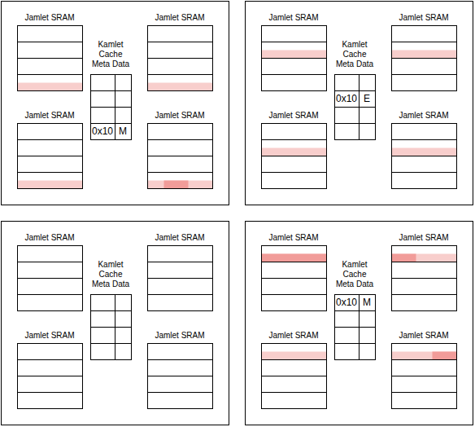
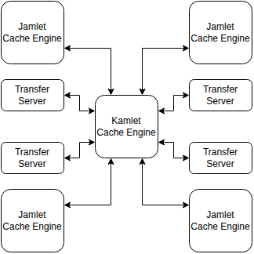

# Cache System

In the diagram below we show how a **stripe** of data is stored in the Zamlet cache.

A **stripe** is a contiguous series of bytes of size `n_lanes * word_width`.  How those bytes
are distributed across the jamlets will depend on the **lane order** and the **element width** of
the stripe.  It will always be distributed across all the kamlets, and each of those kamlets has
a separate memory and a separate cache system.

The **lane order** and the **element width** of a stripe explicitly specifies which jamlet is
responsible for caching each of the bytes of the stripe.  It is not possible for another jamlet to
cache that byte locally.  This means that when a jamlet accesses a non-local byte, it will never be
cached locally, however often the jamlet accesses it.

The system is designed to perform well when data accesses are aligned to the stripe, and when the
element-width matches.  It is not designed to perform well when there are many non-local data
accesses.

In the diagram we see that the stripe (located at 0x10 in the memory) is cached in three of the four
kamlets.  In two of the kamlets the state is 'Modified', while in the other the state is
'Exclusive'.  Because each byte can only be cached in one place the possible states are only
'Invalid', 'Modified' and 'Exclusive'.  Each kamlet independently manages its cache and has no
knowledge of the state of the other kamlet's caches.

## Control

The cache of each kamlet is controlled independently.  The **Kamlet Cache Engine** stores the cache
meta data.  All kinstructions that access local memory query the cache engine to determine whether
the cache line is present.

When a cache miss occurs the **Cache Engine** will allocate a cache slot to the request.  It will
send a message to the **Memlet** over the kamlet network, as well as instructing the **Jamlet Cache
Engines** to send the data for the evicted cache line to the **Memlet**.  The **Jamlet Cache
Engines** will send the evicted data, and then receive responses from the **Memlet** with the data
for the new cache line.  Once this is received they signal to the **Kamlet Cache Engine**.

Once the **Kamlet Cache Engine** sees that all jamlets have retrieved their share of the cache
line it will signal the **Kamlet Transfer Engine** so that any kinstructions that were waiting
on this cache line can proceed.

Memory access requests can also be a result of request messages sent from non-local jamlets.  The
jamlet's **Transfer Server** will send these access requests to the **Kamlet Cache Engine** to
determine if it is a cache hit or miss.  For a cache miss the cache engine will retrieve the
cache line in the manner discussed previously, however it will store the request message
in a table inside the **Kamlet Cache Engine**.  Once the cache line is retrieved the engine
will send the message back to the **Transfer Server** so that it can generate the response.

