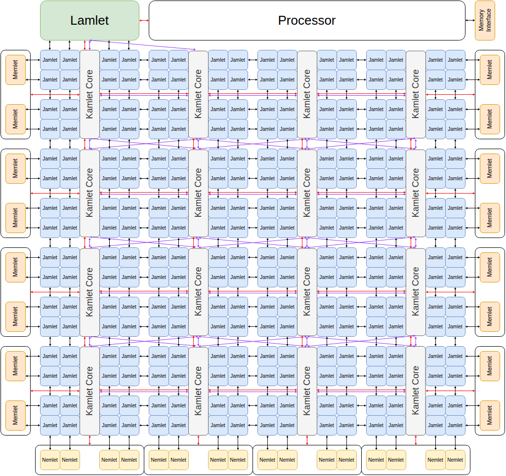
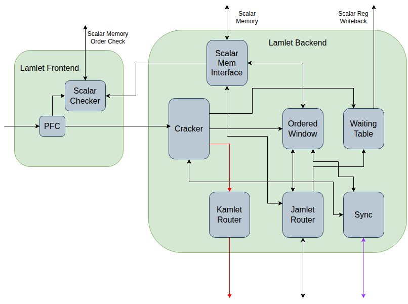
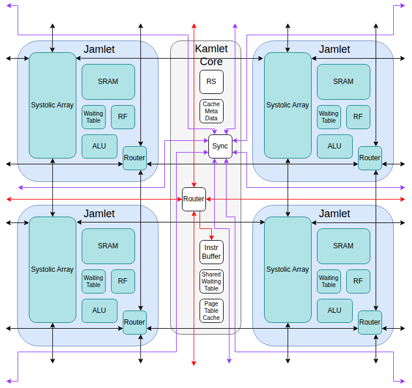

# Hierarchy Overview

At the top level we have a processor, and the zamlet vector processing unit.  We are planning to integrate zamlet initially with the Shuttle processor from UCB.

Internally the zamlet is composed of a 'lamlet' (which acts as the interface to the processor), a mesh of lane-groups (kamlets), two columns
of memory interfaces (memlets), and two rows of network interfaces (nemlets).

## Lamlet

The lamlet receives riscv instructions from the processor, and breaks them down into microoperations (kinstructions, for kamlet instructions) which it then
sends to the mesh of kamlets.

It can be divided into a frontend and a backend, where the frontend operates in lockstep with the
processor pipeline, and the backend is independent (the design closely follows that of the saturn
VPU from UCB).

### Lamlet Frontend

The lamlet frontend contains the following modules:
 
* A **Pipelined Fault Checker (PFC)** which processes the vector instructions, determines what pages
they access and uses the TLB to check for page faults.  In cases where the PFC cannot determine
which pages are accessed the instruction is still passed to the backend, but further instructions
are stalled until the backend has determined whether the instruction faults.

* A **Scalar Checker** which keeps track of which scalar memory pages are in use by vector
instructions.  It has access to the processor's physical addresses for scalar loads and stores and
will stall the processor if there is a conflict in access to scalar memory.

### Lamlet Backend

The lamlet backend contains the following modules:

* A **Cracker** which converts the stream of RISC-V vector instructions into a stream of
kinstructions.  It makes sure each kinstruction accesses at most one page (if the page can be known)
and splits complex instructions such as reductions, into a sequence of kinstructions.

* A **Local Execution** module which determines whether the kinstruction should be broadcast to the
kamlets, sent to the **Lamlet Waiting Table**, or handled by the **Ordered Window** hardware.

* An **Ordered Window** module.  This is responsible for processing ordered loads and stores where
it is not possible to do them in parallel across the jamlets.  This module is responsible for
running the operations by sending packets directly to the jamlets and processing the responses.
It runs as many of these in parallel as it can without violating any ordering requirements.

* A **Waiting Table** module.  Some kinstructions require the lamlet to retain state about the
kinstruction while it is being processed in the kamlet mesh. This module is where the state for
those kinstructions is held, and updated.

* A **JRouter** to connect to the jamlet mesh network.

* A **KRouter** to connect to the kamlet mesh network.

* A **Synchronizer** to participate in the synchronization network.

## Kamlet

The body of the vector processing unit is a mesh of kamlets.  Each kamlet is a grouping of lanes (jamlets) that share:

* An **instruction buffer**.
* A **reservation station** for instruction reordering.
* A **shared waiting table** for storing meta data about in-process kinstructions that require non-local data movement.
* A **cache meta data table** for keeping track of the cache lines stored in the jamlets' SRAM.
* A **synchronizer** for synchronizing between the kamlets and the lamlet.  For example it is used for making sure all kamlets have finished non-local reads before marking that instruction as complete.

## Jamlet

Each jamlet contains:

* SRAM for storing the jamlet's share of the kamlet's cached data (will likely also be used as a scratch pad).
* An ALU.
* A slice of the vector register file.
* A **waiting table** for storing meta data about in-process kinstructions that require non-local data movement.  The jamlet-specific
    data is stored in this table, while the rest of the data is stored in the **shared waiting table** in the kamlet core.
* A **router** supporting two channels for sending and receiving packets between jamlets.  One channel is used for sending requests
    and the other for returning responses.
* A placeholder **systolic array** that will be used for supporting future RISC-V matrix extensions.
    The arrays from neighboring jamlets can be composed into a larger systolic array.

## Memlet

Each kamlet has its own memory interface (memlet).  Memlets are organized in two columns, one east of the kamlet mesh, and one to the west.  Each memlet contains a memory controller
and communicates with a dedicated memory.

## Nemlet
Each kamlet has a network interface (nemlet). Nemlets are organized in a row to the south of the mesh.  Each nemlet communicates independently
over the network with other chips.
(The nemlet is a placeholder. No thought has been put into it yet).
