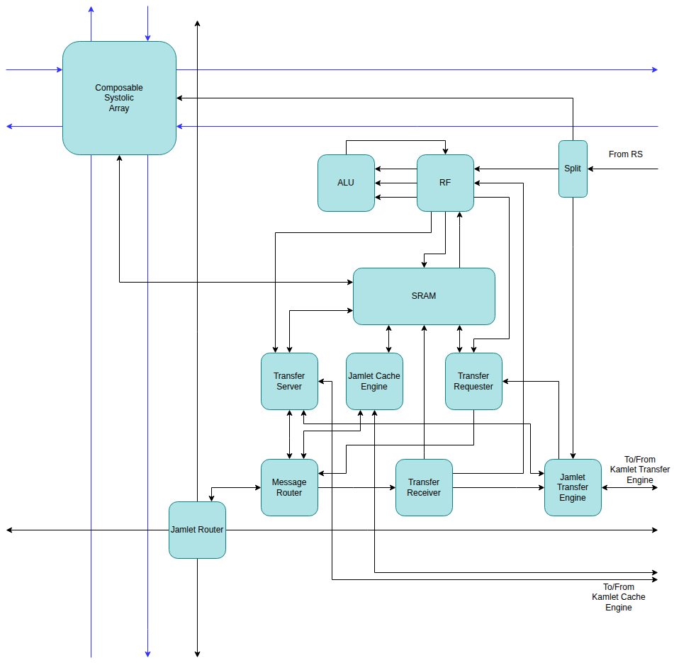

# Jamlet

Kinstructions arrive at the Jamlet from the Reservation Station.  Non-local kinstructions are placed
in the Jamlet Waiting Table, while local Kinstructions are executed directly.

## Splitter

The splitter breaks kinstructions with LMUL>1 into a sequence of configs.

## Vector Register File Slice

The Zamlet Vector Register File is distributed amongst all the jamlets in the mesh.  Each register
file slice has four read ports and two write ports.  The local operations are guaranteed
precedence to the register file ports with deterministic latency, while the non-local operations may
be blocked by the local ones.

## ALU

The ALU isn't well planned out yet.  I'll likely start off by using the implementation from
the Saturn VPU and modifying it to work in the jamlet.

## SRAM

The SRAM is a single-port compiled memory used for storing the jamlet's share of the cache lines.
See [Cache System](cache.md).  It may also be extended to support use as a scratch pad.

## Router

The router connects the jamlet to the jamlet mesh network. This allows the jamlets to exchange
messages. Non-local data movement uses the jamlet network.

## Message Router

The message router routes packets between the main router and the **Cache Engine**, **Transfer
Requester**, **Transfer Receiver**, and **Transfer Server**.

## Jamlet Cache Engine

This module is controlled by the **Kamlet Cache Engine** and is responsible for reading the local
SRAM and generating packets to send cache lines to the **Memlet**, and receiving packets from
the **Memlet** and using them to update the local cache line in the SRAM.

## Jamlet Waiting Table

This **Waiting Table** keeps track of the jamlet-specific state of Non-Local Kinstructions.
Below we show a typical entry in the table.  It shows the status of each byte in the word.

| Byte 0 | Byte 1 | Byte 2 | Byte 3 | Byte 4 | Byte 5 | Byte 6 | Byte 7 |
|--------|--------|--------|--------|--------|--------|--------|--------|
| DONE   | SKIP   | REQ    | SKIP   | REQ    | SKIP   | INIT   | INIT   |

DONE: The processing of this byte is complete. We sent a request and received a response.
SKIP: The byte did not need processing. Here we were operating on 16-bit elements so that
      the byte 0 entry took care of both bytes 0 and 1.
REQ:  A request has been sent but no response received.
INIT: The **Waiting Table** has not started processing these bytes yet.

The **Jamlet Waiting Table** sends an entry together with additional data from the
**Kamlet Waiting Table** to the **Transfer Requester** which uses this information to
generate messages to send to other jamlets.

The **Transfer Receiver** processes the responses from the other jamlets and updates the
**Jamlet Waiting Table** state.

The **Waiting Table** uses the content of this table, as well as the **Kamlet Waiting Table**
to send and receive messages via the **Router**, read and write to the **RF**, read and write
to the **SRAM** and initiate **Systolic Array** operations.

More details can be found in the [Transfer System](transfer_system.md) section.

## Transfer Requester

The transfer processes an entry from the **Jamlet Waiting Table** along with the corresponding
entry from the **Kamlet Waiting Table**.  Using this information it generates packets to send
to other jamlets. It may read both the register file and the SRAM to obtain data for the
packets.

## Transfer Receiver

This module receives the responses from the other jamlets to the transfer requests.  Based on
the content of the packet it will update either the local register file or SRAM, and will
update the **Jamlet Waiting Table** state.

## Transfer Server

The **Transfer Server** is responsible for processing the transfer requests from other jamlets
and generating the transfer responses.  Based on the content of the message the server will
read the register file, read the SRAM, or write the SRAM, and then generate a response message.
Before accessing the SRAM the **Transfer Server** will query the **Kamlet Cache Engine** to
determine if it is a cache hit or miss and to get the cache slot.  If it is a cache miss then the
**Kamlet Cache Engine** will begin fetching the cache line, and will store details of the
request until the cache line is available.  Once the cache line is available it will send the
request information back to the **Transfer Server** so that the server can generate and send
the response.

## Composable Systolic Array

The Jamlet contains a composable systolic array for matrix-matrix multiplications.  It's not
particularly well thought through yet.  The array has a toroidal topology and can be connected
to the arrays of neighboring jamlets to produce a toroidal systolic array of larger dimensions.

It contains buffers where inputs and outputs to the operations can be gradually written and read.
The bandwidth into and out of these buffers is much lower than the speed at which a single systolic
array can consume them, however when multiple systolic arrays are combined into a large array the
input/output bandwidth and computation is balanced.

See [Systolic Array](systolic_array.md).

The details of the required custom instructions for this hardware have not yet been designed.

