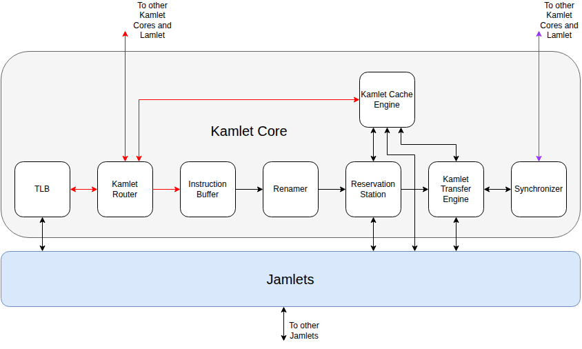

# Kamlet Core

## Kamlet Router

This router connects the kamlet to the kamlet mesh network. It connects the kamlets, memlets, nemlets
and lamlet.  The main purpose of this network is to allow the lamlet to broadcast kinstructions to
the kamlet and to allow the kamlet to send addresses to the memlets.

## Instruction Buffer

This is a FIFO buffer to even out latency differences from the lamlet to the different
kamlets. This is important for instructions that require synchronization between the kamlets.

## Renamer

The renamer maps the 48 logical registers (32 architectural and 16 temporary) to the 48 physical
registers.  It also tracks which of the 16 temporary registers are free, by processing the
FreeRegister kinstructions.  

The **Renamer** and **Reservation Station** live at the kamlet level rather than in the lamlet
because freeing a physical register requires knowing when every jamlet slice of that register has
completed its reads and writes.  The non-determinism of non-local operations makes this impractical
above the kamlet level.
 
## Reservation Station

The **Reservation Station** holds 16 kinstructions that are waiting for their operands, cache lines
and resources (e.g. division unit) to become available.  If there are any in-flight operations that
access the same cache line (i.e. older kinstructions in the **Reservation Station** or kinstructions
in the **Shared Waiting Table**) then that is considered as WR or WW conflicts and the
kinstruction is not released from the RS.  The exception to this is if both kinstructions share a
writeset identifier (see [Custom Instructions](custom_instructions.md#write-sets)), then it is assumed that the two accesses do not conflict.
The setting of writeset identifiers for instructions is supported by custom instructions.

Kinstructions are divided into those that can be locally executed (i.e. they just move data between
the local cache, local register slice and execution units), and those that involve data
movement beyond their jamlet such as register-register permutations, non-aligned loads and stores,
or loads and stores that require access to cache-lines that are not already present in the
cache.

When a kinstruction is released from the reservation station it is either directly executed by the
jamlets or goes into the waiting table (see below) depending on whether it is a local or non-local
operation.

## Kamlet Transfer Engine

Non-local kinstructions are sent to the **Kamlet Transfer Engine**, which can hold the state for 16
non-local kinstructions.  This module drives the **Jamlet Transfer Engines** located in each jamlet
and also uses the **Synchronizer** to make sure that kamlets are synchronized for non-local
operations when necessary.

The entry for each kinstruction in the **Kamlet Transfer Engine** consists of:

| Field          | Width (bits) |
|----------------|--------------|
| Instr Ident    | 7            |
| Writeset       | 5            |
| Cache Slot     | 10           |
| KInstr Details | 24           |

See [Transfer System](transfer_system.md).

## Synchronizer

The synchronizer connects the kamlet to the synchronization network.  The **Shared Waiting Table**
uses it so that kinstructions in the table can wait until synchronization points with the other
kamlets and the lamlet. See [Synchronization](synchronization.md).

## Kamlet Cache Engine

Each kamlet is connected to a memory via a memlet.  All accesses to that memory go through the
kamlet and the **Kamlet Cache Engine** keeps track of the cache meta data, and processes these
requests.  It interacts closely with the **Jamlet Cache Engines** which are located in each 
jamlet.

See [Cache System](cache.md).
