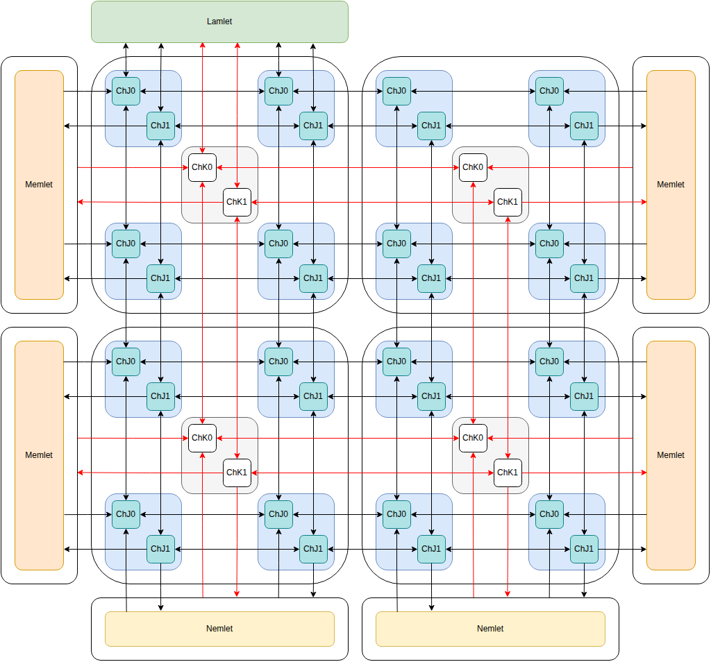

# Network

## Topology

The lamlet, kamlets, jamlets, memlets and nemlets are connected by several 2D mesh networks.

* **Jamlet Network Channel 1:** Requests (black arrows in diagram).
  
* **Jamlet Network Channel 0:** Responses (black arrows in diagram).

* **Kamlet Network Channel 1:** Requests (red arrows in diagram).

* **Kamlet Network Channel 0:** Responses (red arrows in diagram).

## Jamlet Network Traffic

* Any data movement between jamlets (i.e. unaligned load/store, EW-remap, vector permutations, etc)

* Data between jamlets and memlets (cache line reads and writes).

* Data between jamlets and nemlets (network reads and writes).  This would be the data-path for
    DMA transactions. Control would go via the lamlet and then kamlet network.

* Responses from the jamlet mesh to vector instructions (e.g. a scalar return value).

* Responses from the jamlet mesh to scalar instructions (e.g. load/store to vector memory)

* NOTE: The communication between jamlets and memlets, and jamlets and nemlets will likely
        cause to much network traffic.  Rather than adding additional channels it will make
        more sense to add direct connections between them.

* NOTE: Synchronization is not handled over the mesh network. There is an additional
        synchronization network between kamlets [link to sync network].

## Kamlet Network Traffic

* Kinstructions broadcast from the lamlet.

* Addresses to the memlets.

* Non-data responses from the memlets.

## Structure

Both the jamlet network and the kamlet network consist of two independent channels of width 64 bits.
Each node contains a router for each channel.  Each router has 5 inputs and 5 outputs, one for each
cardinal direction, and one for the connecting node.

We use XY routing and wormhole switching.  Packets are limited to 16 flits, but are
typically 2 or 3 flits including header.

| Bits Range | Use |
|------------|-----|
|0-15        | Target Coordinates | 
|15-31       | Source Coordinates | 
|32-35       | Packet Length | 
|36-41       | Message Type | 
|42          | Broadcast | 
|43-63       | Message Type Specific |

[Packet header format]

## Deadlock Avoidance

Each network has two independent channels Channel 0 and Channel 1. Channel 1 is used for request
messages, whereas channel 0 is used for response messages.

Nodes on the network are not permitted to block messages while waiting for other events to occur.
The only permissible reason to have backpressure on Channel 1 is that it has propagated from Channel
0 (i.e. we can't send the Channel 0 response so we can't consume the Channel 1 packet).

A node is never permitted to apply backpressure to Channel 0.  The packet is always a response to a
request that the node sent, so the node should always be prepared to consume the packet.

If a node is not ready to consume a Channel 1 request packet, then it is permitted to send a Channel
0 'Drop' response.  This lets the sender know that it needs to retransmit the packet.  This may
happen if the receiver is further behind in the program execution and doesn't yet have the
necessary context for the message.

## Jamlet Network Performance

We are targetting one clock cycle per hop in the network.  It will likely end up being 2 cycles.
For a 32x32 grid we then expect a latency of roughly 2 * (32 + 32) cycles or 128 cycles for a
message to go from one corner to another.  So roughly 256 cycles for the full request and response.

If we consider a random vector permutation of 64-bit words, roughly half of the words will need
to cross a line bisecting the grid.  Each packet consists of 2 flits, the header and the payload.
For a 32x32 mesh 16 packets can cross the bisection every cycle in each direction, so 32 packets
per cycle.  This means each of the 1024 lanes can send a packet on average every 32 cycles.  Without
congestion we would expect two to four of these permutation instructions might be in-flight at the
same time (i.e. they will be stored in the waiting item table while the kinstructions complete).

For large meshes these kind of permutation operations are slow. For local operations the aggregate
performance of the hardware increases linearly with the number of lanes, but for permutation
operations it is expected to only increase as the squareroot of the number of lanes.  Designing an
efficient program for this hardware requires minimizing this kind of data movement.
