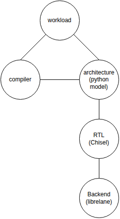

# Current Project State

The scope of this project is fairly ambitious. That's the advantage/disadvantage of doing a project for fun is that
fewer people tell you that you're trying to do something unreasonably hard.

Here I'm just dividing the project into the 5 main areas where development needs to happen.  If you notice verification is
suspicously absent, you'd be right. I'm a long long way from needing rigorous verification yet, and am happy with 
basic unit tests, and running of kernels.

## Workload

I'm aiming to support the risc-v vector spec.  We need workloads that exercise the spec to ensure I implement it
correctly, and I need workloads for common applications to check that I implement it with good performance.
Currently I just have a few small kernels here.

**Next Step:** I'd like to get a generic FFT kernel implemented that performs well.
   

## Compiler
To get good performance I will need customizations to the compiler.  I've haven't done any work on this yet
and have been putting custom assembly in the workloads as a workaround.

**Next Step:** The lowest hanging fruit is supporting vector spilling into the VPU memory.  This is important for
supporting a performant FFT kernel.

## Architecture/Hardware Modelling  

To be able to iterate a bit more quickly I have a python model of the hardware that captures the message passing
approach.  This covers a decent chunk of the vector spec now, but is a long way from complete.

**Next Step:** Continue to increase our coverage of the risc-v vector spec.

## RTL
I'm slowing working on implementing the hardware design in Chisel.  There is still a lot of work to do here.

**Next Step:** Get enough implemented that I can do basic vector loads and stores from the scalar memory and
from the vector memory.  This is mostly a case of implementing the Kamlet.

## Backend
Currently I have a few of the modules from inside the jamlet running successfully through the backend flow
using skywater130 at 100 MHz.

**Next Step:** Choose a module and get the building and using of hard macros working. Either the jamlet or
kamlet would make most sense.  It would also be good to get reasonable area number for the kamlet to
make sure the kamlet overhead is not too expensive.
