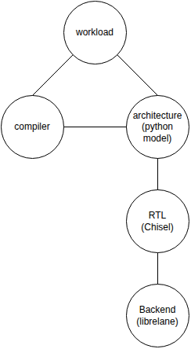

# Current Project State

## Workload

I'm aiming to support the risc-v vector spec.  We need workloads that exercise the spec to ensure I implement it
correctly, and I need workloads for common applications to check that I implement it with good performance.
Currently I just have a few small kernels here.

**Next Step:** I have a FFT kernel that works in the python model.  I can to get some more quantitative
  measurements of the performance and see how it scales with the number of lanes. I need to better understand
  what the current bottleneck is.
   

## Compiler

To get good performance I will need customizations to the compiler.  I currently have a modification to LLVM
to add a separate vector memory stack to support vector register spilling. It was a fairly small change and
was done by Claude Code.  I'll need to understand LLVM a lot better myself before I can start making changes
I'm confident in.

**Next Step:** Current LLVM never uses unordered indexed vector operations.  In would be cool to see if it
could do that for cases where the lack of memory conflicts is easily inferred.

## Architecture/Hardware Modelling  

To be able to iterate a bit more quickly I have a python model of the hardware that captures the message passing
approach.  This covers a decent chunk of the vector spec now.  Also, while updating the documentation I had
lots of ideas for better ways to do things which I need to update the python model with.

**Next Step:** Continue to increase our coverage of the risc-v vector spec.  Update to incorporate new approaches.
              

## RTL
I'm slowing working on implementing the hardware design in Chisel.  There is still a lot of work to do here.

**Next Step:** Get enough implemented that I can do basic vector loads and stores from the scalar memory and
from the vector memory.  This is mostly a case of implementing the Kamlet.

## Backend
Currently I have a few of the modules from inside the jamlet running successfully through the backend flow
using skywater130 at 100 MHz.

**Next Step:** Choose a module and get the building and using of hard macros working. Either the jamlet or
kamlet would make most sense.  It would also be good to get reasonable area number for the kamlet to
make sure the kamlet overhead is not too expensive.
