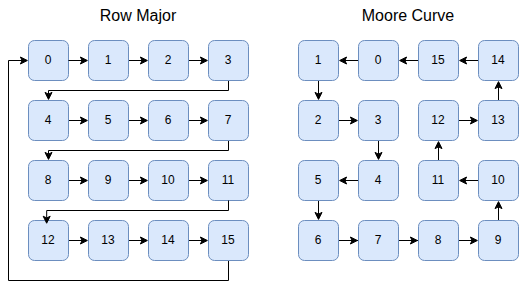
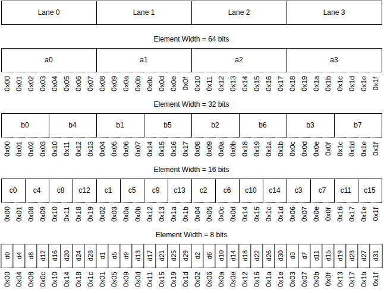
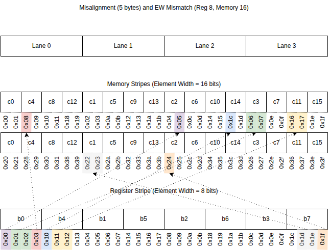

# Stripes, Lane Order And Element Width

## Stripe

The hardware is organized around chunks of data of size `n_lanes * word_width` (`VLEN` in RVV
terminology) which we refer to as **stripes**.  A vector register with LMUL=1 contains a
stripe.  If we have a 32x32 mesh of lanes, a stripe would then be `1024 * 8 B = 8 KiB`.

A stripe of data in the cache is partitioned across the lanes in exactly the same way
that a stripe of data in a vector register is partitioned across the lanes.

Within a stripe how the bytes are ordered depends on two attributes of the
stripe: the **lane order** and the **element width**.

## Lane Order
The lane order specifies in what order the physical lanes are indexed.

A small number of lane orders will be supported (probably just row-major and
Moore, but potentially others if they are useful).  The lane order is set with a
custom instruction in the same way that vtype is set.  The default will be
a Moore curve.

Every additional lane order must be supported by the logic that maps lane
indices to x-y coordinates and x-y coordinates to lane indices.

## Element Width

Within a stripe how the bytes are ordered depends on the element-width of the
instruction that wrote the data to the stripe.  The first element is always
written to lane 0 (either lane 0's cache or vector register file slice), the
second element to lane 1 and so on.

The diagram below shows how elements of size 64-bits, 32-bits, 16-bits and 8-bits
would be laid out in a zamlet with 4 lanes.  Because the RISC-V vector spec
requires that elements are laid out sequentially in the memory, our layout implies that
the byte-ordering in the stripe depends on the element-width. The implied byte
addresses are shown in the diagram below the elements.

The purpose of laying out the vector elements in this way is to maximize the
amount of instructions that are purely local (i.e. they only move data between
the local jamlet cache, local jamlet register slice, and local jamlet
ALU).  For example if we want to add two vectors of 32-bit integers to
produce a LMUL=2 vector of 64-bit integers, we can see that a0 and b0 are both
in lane 0, and a1 and b1 are both in lane 1, despite having different element
widths.

Masks are stripes with an element width of 1 bit. These are interleaved in the same way as
the other examples (but with an element size of 1 bit) and are not treated any
differently from other stripes.

## Effects of Element Width Ordering

Enforcing this ordering makes common operations purely local and very fast. However
when operations are not purely local they are much slower.  Examples of operations
that involve non-local data movement are:

* 1) Reading a register where the element-width of the read does not match the
   element-width with which the register was written.
* 2) Any load/store of memory that is not aligned to the stripe.
* 3) Any load/store of memory where the element-width of the access does not match
   the element-width with which the memory was written.
* 4) Indexed or strided loads or stores
* 5) .. and lots more

## Element Width Lifecycle

When a fresh page is allocated the EW of the stripes is initially undefined.  The first read or
write of the page sets the EW.  Note: It is possible that several indexed loads or stores could be
operating in parallel if they are wrapped in a writesetident (see [Custom Instructions](custom_instructions.md#write-sets)) custom instruction.
In this case the writesetident instruction itself specifies the EW that should be used for a page
with undefined EW.

When a fresh page is first written to by a scalar instruction, the EW of that scalar instruction is
used to set the EW of the stripe, however it is considered a 'weak EW'. A subsequent vector load or
store with a different EW will cause the stripe to get remapped to the vector instruction's EW.
This is because it's a fairly common pattern for scalar instructions to write a stripe with a
different EW than the vector logic will be using, and we don't want to fix the EW to a
non-optimum value.

There are also other situations where we modify the EW of a stripe in memory.  Anytime we do an
aligned unit-stride vector store to a stripe we update the EW of the stripe to match the vector
operation.  If the store rewrites the entire contents of the stripe we don't need to remap the
contents first, if it is only a partial write we need to remap the contents to the new EW first.

Unaligned, strided or indexed stores don't modify the EW of the destination stripe, with the
exception of if the stripe has EW=1.  If the stripe has EW=1 the access will fault.  The lamlet will
then perform a remapping of the memory stripe into the desired EW, and then reattempt the store.

Similarly if an unaligned, strided or indexed store hits an EW=1 stripe, the access will fault, and
the lamlet will perform a remapping followed by a reattempt.

Initially vector registers are set to all 0 with undefined EW. The first read or write sets the EW.
All reads and writes of vector registers require that the EW expected by the kinstruction matches
the EW of the register.  When the lamlet constructs kinstructions it makes sure that this is the
case.  If the EW of the required register does not match then the lamlet will first do a remap onto
a temporary vector register.

## Data Movement for Unaligned and EW Mismatch

The diagram shows patterns of data movement for a load or store with a misalignment (relative to
the stripe boundary) of 5 bytes, and an element width mismatch (the memory uses EW=16 bits while the
register is using EW=8 bits).  We have highlighted a few segments of data and shown how they move
between the register stripe and the memory stripes.  We will refer to the contiguous sequences of
bytes that move together as 'segments'.

In the hardware each of these segment data movements is implemented as a message that is routed on
the jamlet network mesh.
