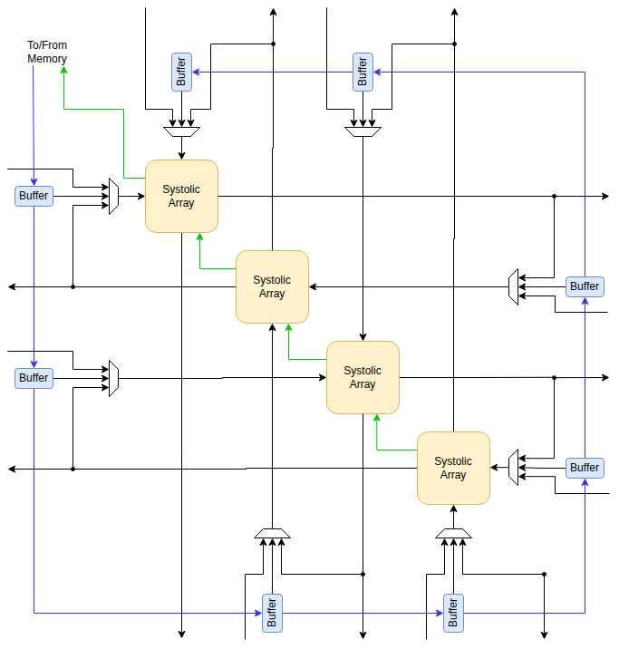

# Systolic Array

The design of the systolic array is a rough sketch of an idea for a systolic array that would be
compatible with the distributed nature of the Zamlet VPU.

Each jamlet contains 4 small systolic arrays that combine to create a larger toroidal systolic array.
Additional it can be combined with the systolic arrays of neighboring jamlets to form a larger
toroidal systolic array, and in the limit all the arrays in the Zamlet VPU can acts as a single
large systolic array.

At the boundary of the array there are buffers which store the inputs for the next operation.  These
buffers are necessary because the bandwidth of data required to initialize the array is much
larger than that provided by the jamlet's SRAM.  These buffers would be gradually filled while one
operations was running, and then would be ready to quickly initialize the next operation when it
was finished.  Similary the systolic arrays would contains two sets of accumulators and one would be
gradually output, while the other was accumulating.

Small matrix-matrix multiplications using a single jamlets systolic array would be extremely
limited by the bandwidth to the SRAM, whereas large matrix-matrix multiplications that combine the
systolic arrays of many jamlets would be well balanced, since the operation would last much longer
as the operands traverse the much large systolic array.

I expect that each of the 4 systolic arrays in the jamlet would have a size of about 8x8 8-bit
operations.

There is no implementation yet, so I have no idea how high the overhead of the buffers, muxes and
additional output registers is.  That cost could easily make this impractical.  There is also a good
chance that distributing a systolic array among the jamlets like this will make the design very
difficult to route.

