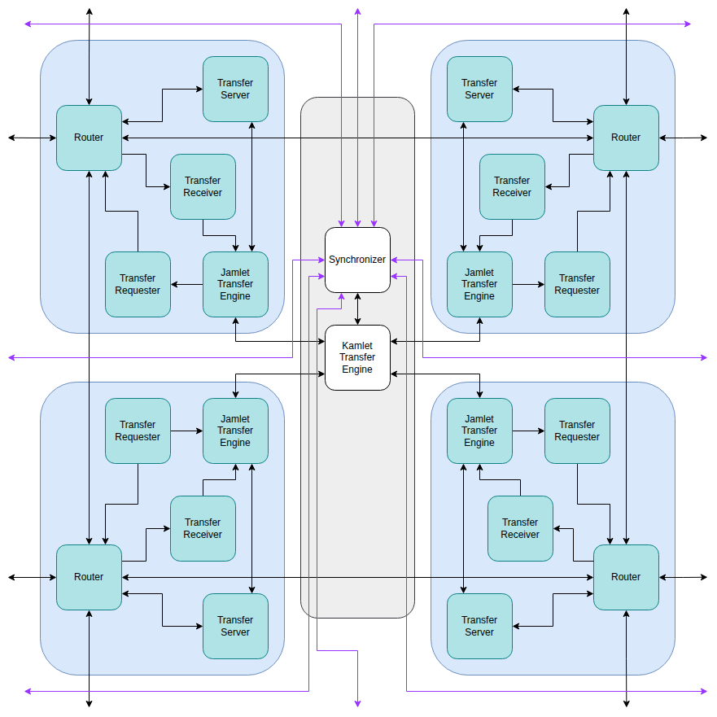

# Transfer System

The transfer system is responsible for carrying out non-local data movement between jamlets.
All movement is initiated by the **Kamlet Transfer Engine**. This receives non-local kinstructions
and stores them in an internal table of depth 16.  Each entry in the **Kamlet Transfer Engine**
table also has an entry in each of the **Jamlet Transfer Engine** tables with the specific
state of the transfer.

The **Transfer Requester** uses the state from the kamlet and jamlet tables to generate request
messages to other jamlets.  Depending on the type of transfer these messages are either received
by the **Transfer Server** or the **Transfer Receiver**.  If the message is received by the
**Transfer Server** then the server makes appropriate reads and writes to that jamlet's register
file and memory and then sends a response message back to the originating jamlet.  If a cache miss
occurs then the message is stored in the **Kamlet Cache Engine** until the cache is available and
a response can be generated.

This response is then received by the **Transfer Receiver** on the originating jamlet (or for
some transfer types the original request is received by the Receiver), and the receiver uses
the content to update its local register file or cache, and then lets the **Jamlet Transfer
Engine** know that the response has been received.

Once all responses have been received the **Jamlet Transfer Engine** lets the **Kamlet Transfer
Engine** know and the synchronizer to synchronize all kamlets before removing this kinstruction.
If the kinstruction is removed before other kamlets have completed the kinstruction then
correct memory ordering is not guaranteed.

## Stored State

### Kamlet Transfer Engine Waiting Kinstruction State

16 entries.
Used to track sending of requests and receiving of responses.
Also used for kinstructions that would be local but have a cache miss.

| Field          | Width (bits) |
|----------------|--------------|
| Instr Ident    | 7            |
| Writeset       | 5            |
| Source Coords  | 16           |
| Cache Slot     | 10           |
| KInstr Details | 24           |

### Kamlet Cache Engine Waiting Request State

32 entries.
Used to track receiving of requests and sending of responses.
Each entry represents the request for a single element.  Entries only
need to be created for cache misses.  For cache misses of writes the
write data is not stored. Once the cache line is available a request
for retransmission of the data is sent.

| Field          | Width (bits) |
|----------------|--------------|
| Instr Ident    | 7            |
| Writeset       | 5            |
| Source Coords  | 16           |
| Cache Slot     | 10           |
| Jamlet         | 4            |
| Source Offset  | 3            |
| Offset         | 3            |
| Width          | 3            |

### Jamlet Transfer Engine Waiting Kinstruction State

16 entries.
Used to track sending of requests and receiving of responses.

| Field        | Width (bits) |
|--------------|--------------|
| Byte States  | 24 (3x8)     |

## Examples

### Aligned, EW-matching Load/Store with a Cache Miss

If it wasn't for the cache miss, this would be a Local KInstruction. However the cache miss means
that it becomes non-local.

* 1) As it leaves the **Reservation Station** the kinstruction is assigned a cache slot.  The
     **Kamlet Cache Engine** begins the process of evicting an existing cache line, and retrieving the
     desired cache line.  The kinstruction is stored in the **Kamlet Transfer Engine** table while the cache
     line is retrieved.

* 2) The **Kamlet Cache Engine** sends a message to the **Memlet** over the kamlet network with the
     address of the line getting evicted, and the address of the line that will replace it.

* 3) The **Kamlet Cache Engine** instructs the **Jamlet Cache Engines** to send the evicted data
     to the **Memlet** over the jamlet network.

* 4) The **Memlet** performs the write and read of the cache lines and then sends the retrieved
     data back to the jamlets over the jamlet network.

* 5) The **Jamlet Cache Engines** update the SRAM with the new cache line and signal the
     **Kamlet Cache Engine** that the update has been done.

* 6) Once the **Kamlet Cache Engine** confirms that all jamlets have updated the cache line then
     it signals to the **Kamlet Transfer Engine** that the cache line has been retrieved.

* 7) Now that the cache line has been retrieved this is a Local-Kinstruction.  The **Kamlet Transfer
     Engine** will insert it into the local execution flow from the Reservation Station when there is
     a gap.

### Unaligned or EW-mismatching Unit-Stride Load with Cache Hits

If the load/store is unaligned with the stripe size, or there is an EW-mismatch between the register
and memory stripe then the operation is non-local.

* 1) The kinstruction leaves the **Reservation Station** and is given a slot in the **Kamlet Transfer Engine**
     and **Jamlet Transfer Engines**.

* 2) In each jamlet the **Transfer Requester** receives the entry from the transfer engine and
     begins to generate and send the request messages.  The **Transfer requester** can work out
     which jamlet wants the data that is in its SRAM. It reads from the SRAM and sends messages
     to those jamlets with the data.

* 4) On each jamlet the **Transfer Receiver** receives the request, writes the data to the local
     register file, and updates the state in the **Jamlet Transfer Engine**.

* 5) Once all required requests have been sent and all expected requests have been received (there
     may be a separate message for each of the 8 bytes in the word), the **Jamlet Transfer Engine**
     will let the **Kamlet Transfer Engine** know that it has completed.

* 6) Once the **Kamlet Transfer Engine** sees that all jamlets have completed the synchronizer is
     triggered.

* 7) When the synchronization completed the kinstruction can be removed.  Note that the **Transfer
     Engines** can be working on many instructions in parallel, and the synchronization network can
     have many synchronizations occurring in parallel so these kinstructions can be effectively
     pipelined.

### An Indexed Store with Cache Misses, Page Faults and accesses to Non-Idempotent Scalar Memory

* 1) The kinstruction leaves the **Reservation Station** and is given a slot in the **Kamlet Transfer Engine**
     and **Jamlet Transfer Engines**.

* 2) In each jamlet the **Transfer Requester** receives the entry from the transfer engine. For each
     element to be stored it reads the local register file to get the offset and data, calculates the
     address and accesses the kamlet TLB to get the page information.

      + If the requester gets a page fault it passes this information back to the **Kamlet Transfer Engine** and stops processing
        this entry.

      + If the requester sees that the page corresponds to non-idempotent memory then it lets the
        **Kamlet Transfer Engine** know that this element is waiting until we know the global page
        fault status, and moves on to the next element.

      + If the requester sees that the page corresponds to idempotent memory then it uses the lane
        order and element width stored in the stripe metadata in the kamlet TLB.  The **Transfer
        Requester** can now determine which jamlet is responsible for each memory byte, and sends a
        message to each jamlet with the data to write.  It lets the **Jamlet Transfer Engine** know
        that the messages have been sent.

* 3) Once the **Jamlet Transfer Engine** sees that the entry has been initialized (all elements have
     checked the TLB) it will respond to the **Kamlet Transfer Engine** with the minimum element
     index that faulted if any.

* 4) The **Kamlet Transfer Engine** will use the synchronizer to determine what the minimum element
     index that faulted was across the entire VPU.  It then passes this minimum back to all the
     **Jamlet Transfer Engines**.

* 5) If the **Jamlet Transfer Engine** is tracking any elements that map to non-idempotent memory
     then these elements can now either be marked as complete if their element index is larger than
     the element index where the first page fault occurred, or they can be marked as free to start
     if their element index is smaller than that of the first page fault.

* 6) In the meantime many of the sent request messages will have arrived at their destination
     jamlets and been processed by their **Transfer Server**.  It receives these requests and checks with
     the **Kamlet Cache Engine** to see if they are a cache hit or miss.  We'll imagine that it is a
     cache miss.  The **Kamlet Cache Engine** stores the request in an internal table and begins the
     process of retrieving the cache line as discussed earlier.

* 7) Once the cache line is retrieved the **Kamlet Cache Engine** sends the request back to the
     **Transfer Server** which can now use the data to update the cache line. The server then
     generates and sends a response packet to let the original jamlet know that the bytes have been
     stored.

* 8) The original jamlet's **Transfer Receiver** receives the response and lets the **Jamlet
     Transfer Engine** know.  Once the **Jamlet Transfer Engine** sees that all elements have
     completed it lets the **Kamlet Transfer Engine** know.

* 9) Once the **Kamlet Transfer Engine** sees that all jamlets have completed it triggers a
     completion synchronization event.

* 10) Once the kamlets synchronize the kinstruction can be removed from the table.

* 11) Meanwhile the lamlet will have received both the minimum fault synchronization and the
      completion synchronization.  It uses these to trigger the fault handler (in case of a page
      fault) and to release any memory locks in Scalar Checker when completion occurs.
