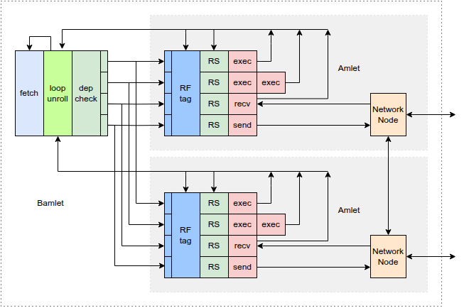

# Zamlet - VLIW SIMT Processor Mesh

A parameterizable open source VLIW SIMT processor designed for mesh accelerators.

## Overview

Zamlet is a research processor implementing a **VLIW (Very Long Instruction Word) SIMT
(Single Instruction, Multiple Thread)** architecture designed for parallel computation across
processing elements in a mesh topology.

This documentation is largely LLM-generated, but I have gone through and checked it for
accuracy and made some edits (such as this sentence).

### Key Features

- **VLIW Architecture**: 6 parallel instruction slots per bundle (Control, Predicate, Packet,
  ALU Lite, Load/Store, ALU)
- **SIMT Execution**: Single instruction stream across multiple processing elements with
  predication support
- **Out-of-Order Execution**: Reservation stations with operand capture and dependency
  resolution
- **Register Versioning**: Version-tagged registers for dynamic dependency tracking  
- **Mesh Network**: Lightweight inter-processor communication with X-Y routing
- **Configurable**: Parameterizable grid sizes, register file sizes, and execution unit 
  configurations

## Architecture Hierarchy

**Damlet** (Future) → **Camlet** (Future) → **Bamlet** (VLIW SIMT Processor) → **Amlet** (Processing Element)

- **Damlet**: Planned multi-core RISC-V system integrated with Bamlet mesh
- **Camlet**: Planned RISC-V core with a Bamlet mesh for acceleration
- **Bamlet**: Top-level processor with 2D grid of Amlets, shared instruction memory and control
- **Amlet**: Individual processing element with out-of-order execution pipeline

## Current Status

**Bamlet Implementation**: Initial implementation complete with basic functionality  
**Testing**: Passing LLM-generated cocotb tests  
**Area Analysis**: ~1.4 mm² in sky130hd (2 Amlets)  
**Timing**: Fails timing at 100 MHz with -2ns slack in sky130hd  
**Verification**: Basic tests passing, real verification work not started
**Performance**: Still writing kernels for performance measurement  

## Quick Numbers

| Metric | Value |
|--------|--------|
| Area (sky130hd) | ~1.4 mm² (2 Amlets) |
| Target Frequency | 100 MHz |
| Current Slack | -2 ns |
| Register Files | 4 types (D/A/P/G registers) |
| Instruction Slots | 6 parallel slots per VLIW bundle |

## Getting Started

1. **[Quick Start Guide](quickstart.md)** - Get up and running with Docker
2. **[Architecture Overview](architecture.md)** - Understand the design
3. **[Instruction Set](instruction-set.md)** - Learn the ISA
4. **[Applications](applications.md)** - See target workloads

## Tools & Technologies

- **RTL**: Written in Chisel (Scala HDL)
- **Testing**: Cocotb (Python testbenches)  
- **Build System**: Bazel
- **PPA Analysis**: OpenLane via bazel-orfs
- **Development**: Significant use of Claude Code for development assistance

## Project Goals

This is a **demonstration project** showcasing:
- Computer architecture concepts
- VLSI design flows
- Integration of multiple open-source EDA tools
- AI-assisted hardware development
